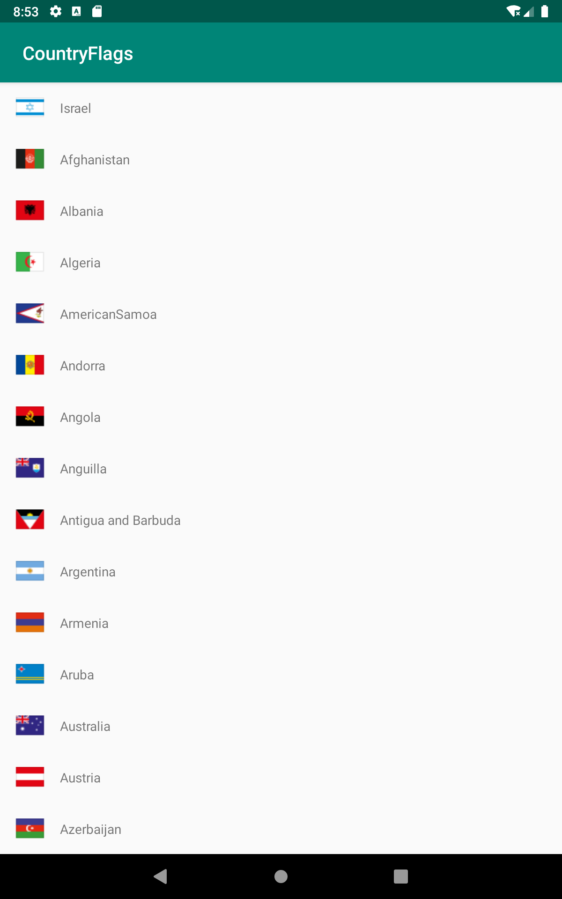

[](https://jitpack.io/#jsramraj/flags)

# Lightweight android library for getting flag image for any country
## This entire library is only **175 kb**. Can you believe that?
Simple, no nonsense, lightweight library for getting flag icon for any country from the two character country code


# How this differs from other libraries
There are plenty of open source libraries available for getting the flag icon. 
But they all include separate image or vector files for each country (there are more than 250 flags in the world) hence become **bulky**.

Unlike all the other libraries, this one includes only **ONE** 
[sprite image](https://github.com/jsramraj/flags/raw/master/flags/src/main/res/drawable/all_flags.png)
which consists of all the icons of
all the flags.

# Demo Screenshot


# Usage
```java
BitmapDrawable usFlag = Flags.forCountry("US")
```
That is all

# How to include
1. Add the JitPack repository to your build file
Add it in your root build.gradle at the end of repositories:
```groovy
allprojects {
	repositories {
		...
		maven { url 'https://jitpack.io' }
	}
}
```
2. Add the dependency
```groovy
dependencies {
  implementation 'com.github.jsramraj:flags:$version'
}
```
Just replace the *$version* with the appropriate version number, for e.g **v1.0**

# Direct include
If, for some reason, you are not okay with adding a entire library, you can still use this by just adding two files into your project.

* Give this library a star
* Drag the [sprite image](https://github.com/jsramraj/flags/raw/master/flags/src/main/res/drawable/all_flags.png) that consists of all the flag icons into your project's asset folder
* Add the [Flags class](https://github.com/jsramraj/flags/blob/master/flags/src/main/java/com/jsramraj/flags/Flags.java) to your project

That is all!!! you are good to go. 

